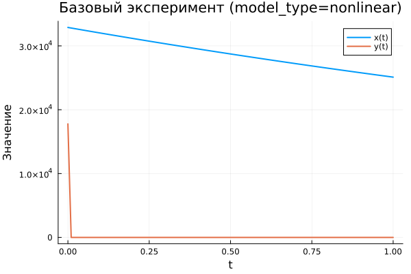
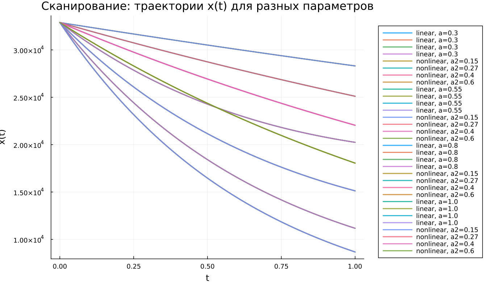

---
## Author
author:
  name: Кенан Гашимов
  email: 1032235820@rudn.ru
  affiliation:
    - name: Российский университет дружбы народов
      country: Российская Федерация
      postal-code: 117198
      city: Москва
      address: ул. Миклухо-Маклая, д. 6

## Title
title: "Математическое моделирование"
subtitle: "Лабораторная работа № 3"
license: "CC BY"
date: today
date-format: "YYYY-MM-DD"
---

# Вводная часть

## Цель работы

Исследовать математические модели Ланчестера, описывающие вооружённое противоборство, и проанализировать, как изменяется численность войск в разных типах боевых сценариев.

## Задание

1. Рассмотреть три разновидности моделей Ланчестера.
2. Построить графики изменения численности противоборствующих сторон.
3. Проанализировать характер поведения решений и определить исход противостояния.

# Теория: модели боевых действий

## Общая идея моделей Ланчестера

В модели участвуют две стороны, численности которых задаются функциями

$$
x(t), \quad y(t)
$$

Если в некоторый момент времени одна из численностей становится равной нулю, то соответствующая сторона считается проигравшей.

## Случай 1: регулярные войска против регулярных войск

Математическая модель имеет вид

$$
\begin{cases}
\frac{dx}{dt}= -a(t)x(t) - b(t)y(t) + P(t) \\
\frac{dy}{dt}= -c(t)x(t) - h(t)y(t) + Q(t)
\end{cases}
$$

В данной системе учитываются:

- потери, не связанные напрямую с боем;
- потери, вызванные огневым воздействием противника;
- поступление подкреплений.

## Случай 2: регулярные войска против партизан

Если одна из сторон представлена партизанскими формированиями, модель принимает вид

$$
\begin{cases}
\frac{dx}{dt}= -a(t)x(t) - b(t)y(t) + P(t) \\
\frac{dy}{dt}= -c(t)x(t)y(t) - h(t)y(t) + Q(t)
\end{cases}
$$

В этом случае потери партизан зависят одновременно от численности регулярной армии и от их собственной численности.

## Случай 3: партизаны против партизан

Когда обе стороны используют партизанскую тактику, система записывается следующим образом:

$$
\begin{cases}
\frac{dx}{dt}= -a(t)x(t) - b(t)x(t)y(t) + P(t) \\
\frac{dy}{dt}= -h(t)y(t) - c(t)x(t)y(t) + Q(t)
\end{cases}
$$

# Упрощённые модели

## Жесткая модель для регулярных армий

Если не учитывать подкрепления и потери небоевого характера, получаем упрощённую систему

$$
\begin{cases}
\frac{dx}{dt}= -by \\
\frac{dy}{dt}= -ax
\end{cases}
$$

Для неё можно получить точное аналитическое решение, а фазовые траектории системы представляют собой гиперболы.

## Качественный вывод

Результат противостояния определяется не только стартовой численностью сторон, но и эффективностью их вооружения.

Из анализа модели следует:

- численное превосходство даёт существенное преимущество;
- для его компенсации требуется заметно более высокая эффективность ведения боя;
- влияние вооружения и организации боя проявляется не линейно, а значительно сильнее.

# Постановка задачи

## Исходные данные

Между страной $X$ и страной $Y$ происходит вооружённое противостояние.

Начальные численности армий равны

$$
x(0)=32888, \qquad y(0)=17777
$$

Требуется построить графики изменения численности войск для двух вариантов модели.

## Случай 1: линейная модель

$$
\begin{cases}
\frac{dx}{dt}= -0.55x(t) - 0.77y(t) + 1.5\sin(3t+1) \\
\frac{dy}{dt}= -0.66x(t) - 0.44y(t) + 1.2\cos(t+1)
\end{cases}
$$

## Случай 2: нелинейная модель

$$
\begin{cases}
\frac{dx}{dt}= -0.27x(t) - 0.88y(t) + \sin(20t) \\
\frac{dy}{dt}= -0.68x(t)y(t) - 0.37y(t) + \cos(10t)
\end{cases}
$$

# Эксперимент: базовые расчёты

## Базовый эксперимент: линейная модель

## Базовый эксперимент: линейная модель

По графику можно сделать следующие выводы:

- обе функции уменьшаются по мере роста времени;
- переменная $x(t)$ убывает достаточно плавно;
- переменная $y(t)$ снижается быстрее и к концу интервала становится близкой к нулю;
- динамика системы остаётся устойчивой и хорошо предсказуемой.

## Базовый эксперимент: нелинейная модель

## Базовый эксперимент: нелинейная модель

Для нелинейного случая наблюдается иная картина:

- функция $x(t)$ уменьшается медленнее, чем в линейной модели;
- функция $y(t)$ очень быстро стремится к нулю;
- после этого основную роль в динамике системы играет переменная $x(t)$;
- нелинейные взаимодействия существенно ускоряют подавление одной из переменных.

# Параметрический анализ

## Сканирование траекторий $x(t)$

## Сканирование траекторий $x(t)$

В процессе исследования варьировался параметр модели.

Получены следующие результаты:

- рост параметра ускоряет убывание $x(t)$;
- траектории становятся более крутыми;
- различия между решениями особенно отчётливо проявляются во второй половине интервала моделирования.

## Сканирование траекторий $y(t)$

## Сканирование траекторий $y(t)$

Анализ показал, что:

- в линейной модели увеличение параметра приводит к более быстрому уменьшению $y(t)$;
- в нелинейной системе $y(t)$ почти сразу становится близкой к нулю;
- зависимость от параметра в нелинейном случае выражена слабее;
- доминирующее влияние оказывают нелинейные члены системы.

# Анализ вычислительных затрат

## Время вычислений

## Время вычислений

По результатам численного эксперимента можно отметить:

- линейная модель требует меньше времени на вычисления;
- время решения линейной системы имеет порядок $10^{-5}$ сек;
- для нелинейной системы характерны значения порядка $10^{-4}$–$10^{-3}$ сек;
- даже при усложнении модели вычислительные затраты остаются малыми.

# Анализ итоговой метрики

## Метрика norm_final

В качестве итоговой характеристики использовалась величина

$$
\text{norm\_final}=\sqrt{x(t_{final})^2 + y(t_{final})^2}
$$

Эта метрика характеризует величину состояния системы в конце процесса моделирования.

## Зависимость norm_final от параметра

## Интерпретация результата

Из анализа графика следует:

- при увеличении параметра значение метрики уменьшается;
- линейная модель быстрее выходит к состоянию покоя;
- нелинейная система дольше сохраняет заметную амплитуду состояния;
- это связано с тем, что переменная $x(t)$ в нелинейной модели затухает медленнее.

# Итоги

## Выводы

1. Линейная модель демонстрирует плавное и устойчивое уменьшение обеих переменных.
2. В нелинейном случае функция $y(t)$ практически сразу обращается в нуль.
3. Параметры модели существенно влияют на скорость изменения решений.
4. В линейной системе это влияние проявляется более наглядно.
5. Нелинейная модель требует больших вычислительных затрат, однако они остаются незначительными.
6. Уменьшение метрики $\text{norm\_final}$ при росте параметра подтверждает усиление затухания динамики.

# Список литературы

1. Законы Осипова — Ланчестера.
2. Дифференциальные уравнения динамики боя.
3. Элементарные модели боя.
