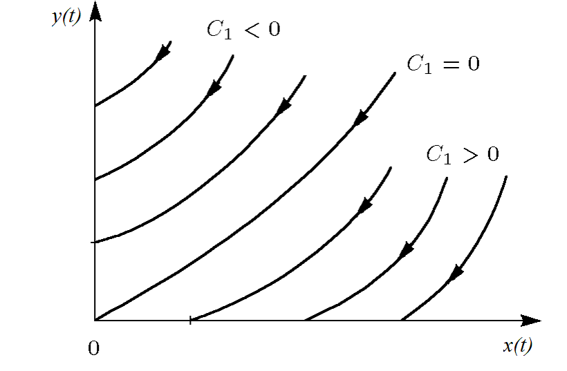

---
## Author
author:
  name: Кенан Гашимов
  email: 1032235820@rudn.ru
  affiliation:
    - name: Российский университет дружбы народов
      country: Российская Федерация
      postal-code: 117198
      city: Москва
      address: ул. Миклухо-Маклая, д. 6

## Title
title: "Математическое моделирование"
subtitle: "Лабораторная работа № 3"
license: "CC BY"
---

# Цель работы

Изучить базовые математические модели вооружённых конфликтов, известные как модели Ланчестера. В таких моделях основным параметром противоборствующих сторон выступает численность их войск. Если в некоторый момент времени численность одной из сторон становится равной нулю, при условии что численность другой стороны остаётся положительной, считается, что первая сторона потерпела поражение.

# Задание

1. Рассмотреть три варианта моделей Ланчестера.
2. Построить графики изменения численности войск.
3. Определить победителя в каждом рассматриваемом сценарии.

# Выполнение лабораторной работы

## Теоретические сведения

Рассматриваются три основных сценария ведения боевых действий:

1. Конфликт между регулярными армиями.
2. Противостояние регулярной армии и партизанских формирований.
3. Конфликт между двумя партизанскими группировками.

### Модель регулярных армий

Численность регулярных войск изменяется под воздействием нескольких факторов:

1. Потери, не связанные непосредственно с боевыми действиями (болезни, травмы, дезертирство).
2. Потери, возникающие в результате боевых столкновений.
3. Пополнение армии за счёт подкреплений.

Динамика численности армий описывается системой дифференциальных уравнений

$$
\begin{cases}
\frac{dx}{dt}= -a(t)x(t) - b(t)y(t) + P(t)
\\
\frac{dy}{dt}= -c(t)x(t) - h(t)y(t) + Q(t)
\end{cases}
$$

Здесь:

- члены $-a(t)x(t)$ и $-h(t)y(t)$ отражают потери, не связанные с боевыми действиями;
- выражения $-b(t)y(t)$ и $-c(t)x(t)$ характеризуют потери в результате столкновений;
- коэффициенты $b(t)$ и $c(t)$ описывают эффективность боевых действий сторон;
- функции $P(t)$ и $Q(t)$ учитывают поступление подкреплений.

### Модель регулярной армии и партизан

Если одна из сторон действует в форме партизанских отрядов, характер взаимодействия изменяется. Партизаны распределены по территории и действуют скрытно, поэтому их потери зависят не только от численности противника, но и от их собственной численности.

В этом случае модель принимает вид

$$
\begin{cases}
\frac{dx}{dt}= -a(t)x(t) - b(t)y(t) + P(t)
\\
\frac{dy}{dt}= -c(t)x(t)y(t) - h(t)y(t) + Q(t)
\end{cases}
$$

### Модель противостояния партизан

Если обе стороны используют партизанскую тактику, взаимодействие между ними становится взаимно нелинейным. Тогда динамика описывается системой

$$
\begin{cases}
\frac{dx}{dt}= -a(t)x(t) - b(t)x(t)y(t) + P(t)
\\
\frac{dy}{dt}= -h(t)y(t) - c(t)x(t)y(t) + Q(t)
\end{cases}
$$

### Упрощённая модель Ланчестера

В простейшем варианте коэффициенты эффективности считаются постоянными, а подкрепления и небоевые потери не учитываются. Тогда система уравнений принимает вид

$$
\begin{cases}
\frac{dx}{dt}= -by
\\
\frac{dy}{dt}= -ax
\end{cases}
$$

Фазовая траектория определяется соотношением

$$
\frac{dx}{dy}=\frac{by}{cx}
$$

Интегрируя, получаем

$$
cxdx = bydy
$$

и далее

$$
cx^2 - by^2 = C
$$

Таким образом, изменение численностей армий происходит вдоль гиперболы, заданной этим уравнением.

{ #fig:001 width=70% height=70% }

Положение начальной точки определяет исход конфликта. Разделяющая линия имеет вид

$$
\sqrt{cx}=\sqrt{by}
$$

Если начальная точка располагается выше этой линии, победу одерживает армия $y$. Если ниже — выигрывает армия $x$. При точном совпадении с разделяющей линией обе армии постепенно истощают друг друга.

Из анализа следует важный вывод: для компенсации численного превосходства противника требуется квадратичное увеличение эффективности вооружения.

### Регулярные войска против партизан

При тех же упрощениях система принимает вид

$$
\begin{cases}
\frac{dx}{dt}= -by(t)
\\
\frac{dy}{dt}= -cx(t)y(t)
\end{cases}
$$

Эта система приводит к интегралу движения

$$
\frac{d}{dt}\left(\frac{b}{2}x^2(t)-cy(t)\right)=0
$$

Отсюда следует

$$
\frac{b}{2}x^2(t)-cy(t)=\frac{b}{2}x^2(0)-cy(0)=C_1
$$

{ #fig:002 width=70% height=70% }

Если $C_1>0$, преимущество имеет регулярная армия. Если $C_1<0$, победу одерживают партизанские силы.

## Задача

Между странами $X$ и $Y$ происходит вооружённый конфликт. Численности армий обозначаются функциями $x(t)$ и $y(t)$.

Начальные условия:

- $x(0)=32888$
- $y(0)=17777$

Предполагается, что коэффициенты $a$, $b$, $c$, $h$ являются постоянными, а функции $P(t)$ и $Q(t)$ непрерывны.

Необходимо построить графики изменения численности войск для следующих моделей.

### 1. Регулярные армии

$$
\begin{cases}
\frac{dx}{dt}= -0.55x(t) - 0.77y(t) + 1.5\sin(3t+1)
\\
\frac{dy}{dt}= -0.66x(t) - 0.44y(t) + 1.2\cos(t+1)
\end{cases}
$$

### 2. Регулярные войска и партизаны

$$
\begin{cases}
\frac{dx}{dt}= -0.27(t) - 0.88y(t) + \sin(20t)
\\
\frac{dy}{dt}= -0.68x(t)y(t) - 0.37y(t) + \cos(10t)
\end{cases}
$$

Для проведения численного моделирования и построения графиков использовались внешние файлы с программным кодом:





## Базовые эксперименты

### Линейная модель (model_type = linear)

На графике представлено изменение функций $x(t)$ и $y(t)$ для линейной модели.

Обе переменные демонстрируют устойчивое снижение со временем. Функция $x(t)$ уменьшается относительно плавно и остаётся положительной на всём интервале моделирования.

Функция $y(t)$ убывает значительно быстрее и в конце рассматриваемого интервала практически достигает нулевого значения.

Подобное поведение характерно для линейных систем, где решения экспоненциально стремятся к состоянию равновесия.

### Нелинейная модель (model_type = nonlinear)

Для нелинейного варианта динамика системы существенно меняется.

Функция $x(t)$ снижается медленнее, чем в линейной модели, и сохраняет достаточно высокие значения на протяжении всего интервала.

Переменная $y(t)$, напротив, почти мгновенно уменьшается до значений, близких к нулю, и затем остаётся на этом уровне.

Это связано с влиянием нелинейных членов системы, которые резко усиливают скорость затухания одной из переменных.

## Параметрическое сканирование

### Траектории $x(t)$ для различных параметров

Было проведено исследование чувствительности модели к изменению параметров.

Для линейной системы изменялся параметр $a$, а для нелинейной — параметр $a_2$.

Наблюдается следующая закономерность:

- при малых значениях параметра уменьшение $x(t)$ происходит медленно;
- увеличение параметра ускоряет спад функции;
- различия между траекториями становятся заметными уже в середине интервала времени.

Для нелинейной модели влияние параметра сохраняется, однако форма траекторий становится более сложной.

### Траектории $y(t)$ для различных параметров

Аналогичный анализ проведён для функции $y(t)$.

В линейной системе увеличение параметра ускоряет убывание функции, и значение быстрее стремится к нулю.

В нелинейной модели ситуация иная: функция $y(t)$ практически сразу принимает значение, близкое к нулю, вне зависимости от параметра.

Это подтверждает сильное влияние нелинейных взаимодействий.

## Время вычислений

Проведено сравнение времени вычислений при решении систем дифференциальных уравнений.

Получены следующие результаты:

- линейная система решается быстрее;
- время вычисления составляет порядка $10^{-5}$ секунд;
- для нелинейной системы время увеличивается до $7\cdot10^{-4}$–$9\cdot10^{-4}$ секунд.

Тем не менее абсолютное время расчёта остаётся крайне малым.

## Анализ итоговой метрики norm_final

Для оценки итогового состояния системы использовалась величина

$$
\text{norm\_final} = \sqrt{x(t_{final})^2 + y(t_{final})^2}
$$

Данная метрика характеризует норму состояния системы в конечный момент времени.

Анализ показывает:

- увеличение параметра приводит к уменьшению значения метрики;
- линейная модель быстрее приближается к состоянию покоя;
- в нелинейной модели значение метрики остаётся более высоким.

Это свидетельствует о более медленном затухании динамики в нелинейной системе.

# Выводы

1. Линейная модель характеризуется плавным и предсказуемым уменьшением переменных $x(t)$ и $y(t)$ во времени.

2. В нелинейной модели динамика существенно отличается: переменная $y(t)$ быстро уменьшается до нуля, и дальнейшее поведение системы определяется главным образом переменной $x(t)$.

3. Параметры системы оказывают заметное влияние на скорость изменения решений.

4. Для нелинейной модели влияние параметров на переменную $y(t)$ оказывается значительно слабее.

5. Численный эксперимент показывает, что линейные системы вычисляются быстрее, однако даже для нелинейных моделей время расчёта остаётся очень малым.

6. Итоговая метрика состояния системы $\text{norm\_final}$ уменьшается при увеличении параметров, что отражает усиление затухания динамики.

Полученные результаты соответствуют теоретическим ожиданиям и подтверждают корректность проведённого численного моделирования.

# Список литературы {.unnumbered}

1. [Законы Осипова — Ланчестера](https://ru.wikipedia.org/wiki/Законы_Осипова_—_Ланчестера)
2. [Дифференциальные уравнения динамики боя](https://zen.yandex.ru/media/id/5fd3c685994c494848984b63/differencialnye-uravneniia-dinamiki-boia-5fd4bcc45a2c8e1f2cc208f1)
3. [Элементарные модели боя](https://intuit.ru/studies/educational_groups/594/courses/499/lecture/11353?page=7)
