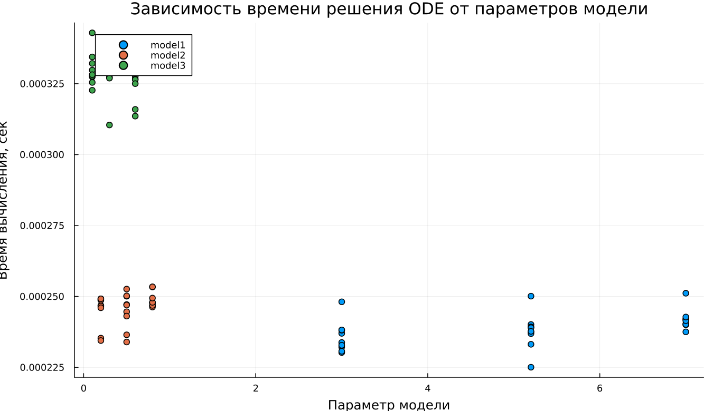

---
## Author
author:
  name: Кенан Гашимов
  email: 1032235820@rudn.ru
  affiliation:
    - name: Российский университет дружбы народов
      country: Российская Федерация
      postal-code: 117198
      city: Москва
      address: ул. Миклухо-Маклая, д. 6

## Title
title: "Математическое моделирование"
subtitle: "Лабораторная работа № 4"
license: "CC BY"
---

# Цель работы

Исследовать математическую модель гармонического осциллятора и проанализировать различные режимы его поведения.

# Задание

1. Построить решение уравнения гармонического осциллятора без учета затухания  
2. Записать и исследовать уравнение осциллятора с затуханием, включая фазовый портрет  
3. Рассмотреть систему под действием внешней силы, построить решение и фазовый портрет  

# Выполнение лабораторной работы

## Теоретические сведения

Многие процессы в различных областях науки могут быть сведены к единой математической модели второго порядка. К таким системам относятся механические, электрические и даже биологические объекты. В основе их описания лежит модель линейного гармонического осциллятора.

Общее уравнение движения имеет вид:
$$
\ddot{x} + 2\gamma \dot{x} + \omega_0^2 x = 0
$$

где $x$ — состояние системы, $\gamma$ — коэффициент потерь, $\omega_0$ — собственная частота.

Если диссипация отсутствует ($\gamma = 0$), система становится консервативной:
$$
\ddot{x} + \omega_0^2 x = 0
$$

Для получения конкретного решения необходимо задать начальные условия:
$$
\begin{cases}
x(t_0) = x_0 \\
\dot{x}(t_0) = y_0
\end{cases}
$$

Переход к системе первого порядка:
$$
\begin{cases}
\dot{x} = y \\
\dot{y} = -\omega_0^2 x
\end{cases}
$$

Соответствующие начальные условия:
$$
\begin{cases}
x(t_0) = x_0 \\
y(t_0) = y_0
\end{cases}
$$

Пара $(x, y)$ задаёт фазовое пространство. Каждому решению соответствует траектория на фазовой плоскости. Совокупность таких траекторий формирует фазовый портрет, отражающий динамику системы.

## Задача

Требуется построить решения и фазовые портреты для следующих моделей:

1. Без затухания:
$$
\ddot{x} + 5.2x = 0
$$

2. С затуханием:
$$
\ddot{x} + 14\dot{x} + 0.5x = 0
$$

3. С затуханием и внешним воздействием:
$$
\ddot{x} + 13\dot{x} + 0.3x = 0.8\sin(9t)
$$

Интервал моделирования: $t \in [0; 59]$, шаг $0.05$,  
начальные условия: $x_0 = 0.5$, $y_0 = -1.5$

### Преобразование моделей

1. Без затухания:
$$
\begin{cases}
\dot{x} = y \\
\dot{y} = -\omega_0^2 x
\end{cases}
$$

2. С затуханием:
$$
\begin{cases}
\dot{x} = y \\
\dot{y} = -2\gamma y - \omega_0^2 x
\end{cases}
$$

3. С внешней силой:
$$
\begin{cases}
\dot{x} = y \\
\dot{y} = F(t) - 2\gamma y - \omega_0^2 x
\end{cases}
$$

Для численного моделирования использовались внешние программные модули:





## Базовые эксперименты

### Первая модель (model_type = model1)

График $y(t)$ демонстрирует устойчивые периодические колебания без изменения амплитуды. Форма сигнала регулярна и повторяется во времени.

Такое поведение свидетельствует об отсутствии потерь энергии. Система сохраняет своё состояние и не стремится к равновесию.

Фазовая траектория представляет собой замкнутую кривую, что указывает на периодичность движения. Система остаётся в пределах устойчивого режима.

Итак, модель описывает идеальные колебания без диссипации.

### Вторая модель (model_type = model2)

График показывает быстрое снижение амплитуды. Уже на начальном этапе система теряет энергию и приближается к состоянию покоя.

Причиной является наличие демпфирования, которое подавляет колебания.

Фазовая траектория сжимается к равновесной точке, что отражает исчезновение движения.

Таким образом, система демонстрирует апериодическое затухание.

### Третья модель (model_type = model3)

После переходного процесса система выходит на режим малых устойчивых колебаний.

Несмотря на затухание, внешняя сила поддерживает движение, не позволяя системе полностью остановиться.

Фазовый портрет формирует компактную замкнутую область около равновесия.

Следовательно, наблюдаются установившиеся вынужденные колебания.

## Параметрическое сканирование

### Траектории $x(t)$

Параметры влияют на поведение моделей следующим образом:

- в первой модели изменяется частота колебаний;
- во второй — скорость затухания;
- в третьей — характеристики вынужденного режима.

Общие закономерности:

- первая система остаётся колебательной;
- вторая стремится к равновесию;
- третья стабилизируется на вынужденных колебаниях.

### Траектории $y(t)$

Поведение аналогично:

- устойчивые колебания в первой модели;
- быстрое затухание во второй;
- поддерживаемые колебания в третьей.

## Время вычислений

Результаты показывают:

- минимальное время у первой модели;
- умеренное — у второй;
- наибольшее — у третьей.

Тем не менее, вычисления во всех случаях выполняются быстро.

## Анализ метрики norm_final

Рассматривается величина:
$$
\text{norm\_final} = \sqrt{x(t_{final})^2 + y(t_{final})^2}
$$

Наблюдения:

- в первой модели значение остаётся значительным;
- во второй — стремится к нулю;
- в третьей — стабилизируется на малом уровне.

# Выводы

1. Первая модель описывает идеальные незатухающие колебания  
2. Вторая модель приводит систему к покою за счёт диссипации  
3. Третья модель формирует устойчивые вынужденные колебания  
4. Параметры определяют частоту, скорость затухания и амплитуду  
5. Численные методы обеспечивают быструю обработку  
6. Метрика $\text{norm\_final}$ отражает различия динамики  

# Список литературы {.unnumbered}

1. [Гармонический осциллятор](https://ru.wikipedia.org/wiki/Гармонический_осциллятор)  
2. [Модели колебательных систем](https://www.numamo.org/HTML/Articles/Oscillator.html)  
